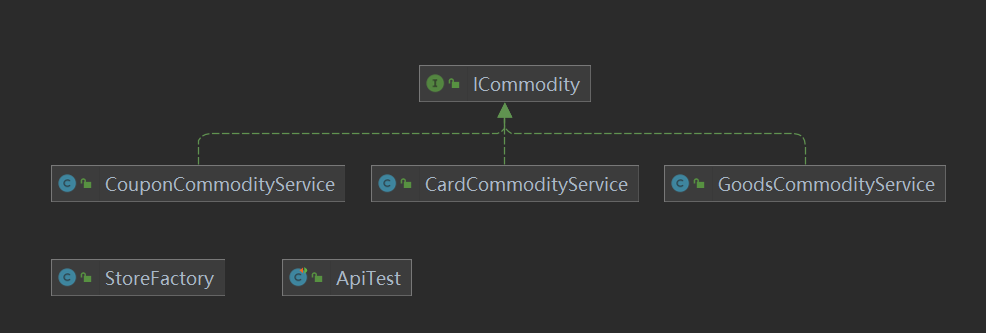

# 创建型模式
提供创建对象的机制，提升代码的灵活性和可复用性

## 1.工厂模式
定义一个创建对象的接口，让其子类自己决定的实例化哪一个类。  
工厂模式让创建过程延迟到子类进行。

****
开发环境
1. JDK 1.8
2. `IDEA`+`Maven`
***

### 实战场景 
模拟积分兑换中发放不同类型的产品  
#### 1.用 `if/else`判断来做
| 序号        | 类型   |  接口  |
| --------   | -----:  | :----:  |
| 1     | 优惠券 |   `CouponResult sendCoupon(String uid...)`     |
| 2        |   实物商品   |   `Boolean deliverGoods(DeliverReq req)`   |
| 3        |    爱奇艺兑换卡   |  `void grantToken(String bindMobileNumber String cardId)`  |

```java
public AwardRes awardToUser(AwardReq req) {
        
        try {
            // 按照不同类型方法商品[1优惠券、2实物商品、3第三方兑换卡(爱奇艺)]
            if (req.getAwardType() == 1) {
                CouponService couponService = new CouponService();//优惠券service
                CouponResult couponResult = couponService.sendCoupon(...);//传入参数 输出优惠券领取结果
            } else if (req.getAwardType() == 2) {
                GoodsService goodsService = new GoodsService();//实物商品service
                DeliverReq deliverReq = new DeliverReq();//地址请求等信息
                
            } else if (req.getAwardType() == 3) {
                String bindMobileNumber = queryUserPhoneNumber(req.getuId());//兑换码
                IQiYiCardService iQiYiCardService = new IQiYiCardService();//兑换码service
                
            }
           
        } catch (Exception e) {
           
        }

        return awardRes;
    }
```
* 传统模式开发  
   **优点：** 可以很快完成需求  
   **缺点：** 难以维护

#### 2.工厂模式实现

****
  
****
* 定义发奖接口 `ICommodity`
```java
void sendCommodity(String uId, String commodityId, String bizId, Map<String, String> extMap) throws Exception;
```
入参：用户id，奖品id，业务id，扩展字段

* 三个实现类
  * `CouponCommodityService` 优惠券实现类
  * `CardCommodityService`兑换卡实现类
  * `GoodsCommodityService`实物商品实现类  
  
  *每一种奖品的实现都在对应的类中，增加、修改、删除都不会影响其他奖品的功能测试。后续添加只需在此结构上填充，易于扩展。统一了传入参数，后续调用不用关心传入参数，按照统一逻辑进行即可。*

* 商品工厂
  `StoreFactory`
  ```java
  public class StoreFactory {

    public ICommodity getCommodityService(Integer commodityType) {
        if (null == commodityType) return null;
        if (1 == commodityType) return new CouponCommodityService();
        if (2 == commodityType) return new GoodsCommodityService();
        if (3 == commodityType) return new CardCommodityService();
        throw new RuntimeException("不存在的商品服务类型");
         } 
    } 
    ```
### 总结
* 避免创建者与具体的参数耦合、满足单一职责，每一个业务逻辑都在自己的类中完成，
* 满足开闭原则，无需调用方法，就可以实现引入新的产品类型。